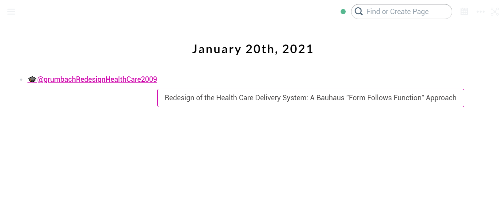

## roam-get-paper-data
Adds a `data-paper-title` attribute to each page reference that links to a page whose title starts with `@`. The value is equal to the contents of the block with attribute `Title::` located on that page, and is accessible directly in JavaScript and CSS.

### Example of use in CSS

```css
span[data-link-title^="@"][data-paper-title]:hover::after {
    content: attr(data-paper-title);
    background-color: white;
    position: absolute;
    margin-top: 2em;
    padding: 0.5em 1em;
    border: 1px #d00aae solid;
    border-radius: 4px;
  	transition: 5ms;
}
```

